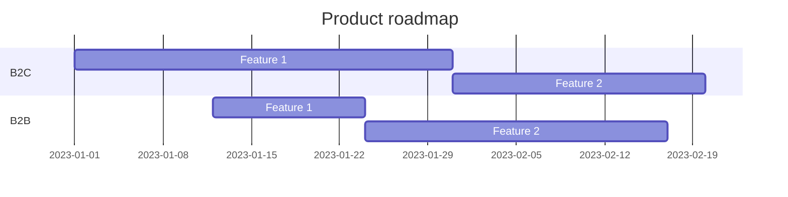

# Product Roadmap

> Add your own awesome project roadmap here

## V1

## Solution

- [ ] Gestion des Nullable
- [ ] Clean warnings

## Template

- [x] Setup dotnet template
- [x] Documentation as code option
- [ ] Backend As A Service option
- [ ] Infrastructure as Code option
- [ ] Microservice generator option

## Clients
- [x] Blazor PWA
  - [x] Setup mudblazor UI
  - [x] Setup Preferences & Settings
      - [x] Dark / Light mode
      - [x] Drawer open
      - [x] Language support
  - [x] Setup Authentication
  - [x] Setup Feature management
  - [x] Setup Globalization
  - [ ] Refactoring program.cs
    - [x] Setup PWA
- [x] SDKs
  - [x] GraphQL SDK
  - [ ] REST SDK
    - [x] Setup
    - [ ] Automate swagger.json output from api project
- [x] BFF
    - [x] blazor hosted
    - [x] reverse proxy APIs (YARP)
    - [x] GraphQL gateway & schema stitching
    - [ ] File upload sample

## Services
### TodoList 
- [ ] Core
    - [x] Domain 
      - [x] Setup aggregate root
      - [x] Setup entities
      - [x] Setup domain events
      - [x] Setup repository interface
      - [x] Setup exceptions
    - [ ] Application
        - [x] Common behaviours
        - [x] Mappings
        - [ ] Features
            - [x] Todolist
                - [x] Commands
                  - [x] Create todo list
                  - [x] Delete todo list
                  - [x] Update todo list
                  - [x] Create todo item
                  - [x] Delete todo item
                  - [x] Toggle todo item
                - [x] Queries
                  - [x] Get all todo lists by user
                  - [x] Get todo list by id
                - [x] Policies
                  - [x] Todolist created by policy requirement
                - [x] Events
                  - [x] SendMailOnTodoListCompleted
                  - [x] OnTodoListCompletedIntegrationEvent
  - [ ] Infrastructure
    - [x] App settings (IOption validation)
    - [ ] Persistence
         - [x] Entity framework
           - [x] EF Entities configuration
           - [x] EF Migration
         - [ ] MartenDB
    - [ ] External systems implementation
        - [x] Storage
        - [x] User
        - [x] Mail
    - [ ] Bus
        - [x] MassTransit
          - [x] RabbitMQ
          - [ ] Azure Service Bus
          - [ ] Amazon SQS
          - [ ] OpenTelemetry
- [ ] Interface
    - [x] GraphQL API
      - [ ] Refactoring with QueryType et MutationType attributes ?
    - [x] REST API
      - [ ] Missing one operation
    - [x] Authentication
        - [x] OPENID JWT
        - [x] MASTER KEY
    - [x] Authorization
    - [x] HealthCheck
    - [x] Feature management
    - [x] Auto migration option
    - [ ] Users endpoints
      - [ ] Keycloak service
      - [ ] AAD service
    - [ ] SignalR websocket use case
      - [ ] Listen service bus
    - [ ] OpenTelemetry
      - [x] REST api
      - [ ] GraphQL api
    
- [ ] Tests
    - [x] Setup Unit tests
    - [x] Setup Architecture tests
    - [ ] Setup Integration tests
    - [x] Setup E2E tests
        - [x] Setup playwright NUnit project
        - [x] Home page test
        - [ ] Login / logout test
        - [ ] Todolist test
          - [ ] Create todo list test
          - [ ] Delete todo list test
          - [ ] Update todo list test
          - [ ] Create todo item test
          - [ ] Delete todo item test
          - [ ] Toggle todo item test

### Storage (optional) ?
- [x] Azure blob storage
- [x] Minio
- [ ] AWS S3
- [x] File system

###  Workflow (optional)
- [ ] Elsa core

###  Scheduled Jobs (optional)
- [ ] Hangfire

## Cross cutting 
- [x] SharedKernel
    - [x] use mediatr contract only
- [x] Refactoring to move Microscope.Storage crosscutting lib

## IAC
- [ ] docker-compose
    - [x] postgres
    - [x] keycloak 22
      - [x] import realms configuration
    - [x] Service Bus RabbitMQ
    - [x] Todo service
    - [x] BaaS (Hasura)
    - [x] BFF
    - [x] Docs
    - [x] Microsoft.Build.Container
    
- [ ] Pulumi stack
  - [x] Setup Pulumi 
  - [ ] Azure
  - [ ] AWS
  - [ ] GCP

- [ ] Terraform
  - [x] Setup Terraform project
  - [ ] Azure
  - [ ] AWS
  - [ ] GCP
  
- [ ] K8S

## Docs
- [x] Setup vitepress
  - [x] Mermaid
  - [x] PDF export
  - [x] Task list
- [x] Setup revealjs slides
- [x] Setup docs web server as static files & container

----------------------------

## Open source inputs

#Interfaces
- GraphQL : plutot que les partials, moi j'utilise [QueryType] et [MutationType] et en utlilisant le package HotChocolate.Types.Analyzers (source generator --> .AddTodoAppTypes())
- Grapql Queries / Mutations --> static

-------------------------

## Roadmap (sample)

