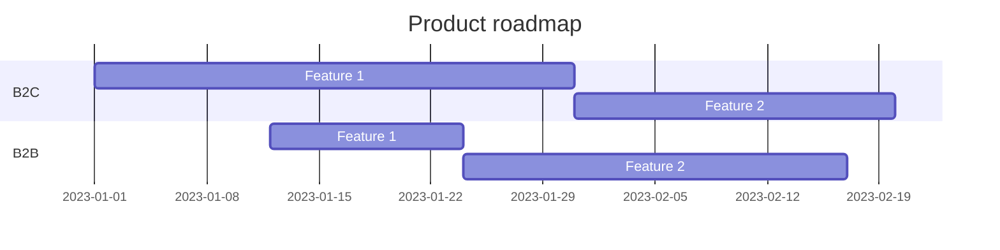

# Product Roadmap

> Add your own awesome project roadmap here

# V1

## Solution

- [x] Hasura JWT 
- [x] Keycloak default role & role mapping
- [x] Dotnet 8 migration
- [ ] Nullables
- [ ] Clean warnings
- [ ] Clean todos

## Template

- [x] Setup dotnet template
- [ ] Multi template
  - [ ] Complete template
    - [x] "Doc as code" option
    - [ ] "CLI“ option
    - [ ] "E2E" tests option
    - [ ] "Infrastructure as Code" option
    - [ ] "Backend As A Service" option
  - [ ] "Service" template
    - [ ] Hexagonal (copy of TodoAppService ?)
    - [ ] Vertical slice
  - [ ] "Doc as code" template
      - [ ] Copy of docs
  - [ ] Mobile template ?

## Clients
- [ ] Blazor SSR -- DOING
  - [ ] Dependency injection SSR
- [x] Blazor PWA
  - [x] Setup mudblazor UI
  - [x] Setup Preferences & Settings
      - [x] Dark / Light mode
      - [x] Drawer open
      - [x] Language support
  - [x] Setup Authentication
  - [x] Setup Feature management
  - [x] Setup Globalization
  - [ ] Refactoring program.cs
    - [x] Setup PWA
- [x] SDKs
  - [x] GraphQL SDK
    - [ ] SDK generation with admin key dotnet graphql -x x-hasura-admin xxx
  - [ ] REST SDK
    - [x] Setup
    - [ ] Automate swagger.json output from api project
- [x] BFF
    - [x] blazor hosted
    - [x] reverse proxy APIs (YARP)
    - [x] GraphQL gateway & schema stitching
    - [ ] Forward all headers during schema stitching (related to sdk generation as admin)
    - [ ] File upload sample

## Services
### TodoList 
- [ ] Core
    - [x] Domain 
      - [x] Setup aggregate root
      - [x] Setup entities
      - [x] Setup domain events
      - [x] Setup repository interface
      - [x] Setup exceptions
    - [x] Application
        - [x] Common behaviours
        - [x] Mappings
        - [x] Features
            - [x] Todolist
                - [x] Commands
                  - [x] Create todo list
                  - [x] Delete todo list
                  - [x] Update todo list
                  - [x] Create todo item
                  - [x] Delete todo item
                  - [x] Toggle todo item
                - [x] Queries
                  - [x] Get all todo lists by user
                  - [x] Get todo list by id
                - [x] Policies
                  - [x] Todolist created by policy requirement
                - [x] Events
                  - [x] SendMailOnTodoListCompleted
                  - [x] OnTodoListCompletedIntegrationEvent
    - [ ] Infrastructure
      - [x] Infrastructure settings (IOption validation)
      - [ ] Persistence
           - [x] Entity framework
             - [x] EF Entities configuration
             - [x] EF Migration
           - [ ] MartenDB
      - [x] External systems implementation
          - [x] Storage
          - [x] User
          - [x] Mail
      - [ ] Bus
          - [x] MassTransit
            - [x] RabbitMQ
            - [ ] Azure Service Bus
            - [ ] Amazon SQS
            - [ ] OpenTelemetry
    - [ ] Interface
        - [x] GraphQL API
          - [x] GraphQL documentation
          - [ ] Refactoring with QueryType et MutationType attributes ?
        - [x] REST API
          - [x] OpenAPI documentation
          - [ ] Complete missing operations
        - [ ] Async API / messenging documentation
        - [x] Authentication
            - [x] OPENID JWT
            - [x] MASTER KEY
        - [x] Authorization
        - [x] HealthCheck
        - [x] Feature management
        - [x] Auto migration option
        - [x] Interface settings (IOption validation)
        - [ ] Users endpoints
          - [ ] Keycloak service
          - [ ] AAD service
        - [ ] SignalR websocket use case
          - [ ] Listen service bus
        - [ ] OpenTelemetry
          - [x] REST api
          - [ ] GraphQL api
    
    - [ ] Tests
        - [x] Setup Unit tests
        - [x] Setup Architecture tests
        - [ ] Setup Integration tests
        - [x] Setup E2E tests
            - [x] Setup playwright NUnit project
            - [x] Home page test
            - [x] Login test
            - [x] Todolist test
              - [x] Create todo list test
              - [x] Update todo list test
              - [x] Create todo item test
              - [x] Toggle todo item test
              - [x] Delete todo item test
              - [x] Delete todo list test

### Storage (optional) ?
- [x] File system
- [x] Azure blob storage
- [ ] AWS S3
- [x] Minio
  - [ ] Upgrade minio sdk to 6.x

###  Workflow (optional)
- [ ] Elsa core

###  Scheduled Jobs (optional)
- [ ] Hangfire

## Cross cutting 
- [x] SharedKernel
    - [x] use mediatr contract only
- [x] Refactoring to move Microscope.Storage crosscutting lib

## IAC
- [x] docker-compose
- [ ] Pulumi
  - [x] Setup Pulumi 
  - [ ] Azure
  - [ ] AWS
  - [ ] GCP
- [ ] Terraform
  - [x] Setup Terraform project
  - [x] Azure
  - [ ] AWS
  - [ ] GCP
- [ ] K8S
- [ ] Aspire

## Docs
- [x] Setup vitepress
  - [x] Mermaid
  - [x] PDF export
  - [x] Task list
- [x] Setup revealjs slides
- [x] Setup docs web server as static files & container
- [x] PRD & SDD template

----------------------------

## Roadmap (sample)

