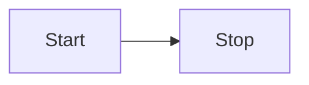

# Aggregate Design Canvas

## ⚡︎ Name

**Todo list**

## 🎯 Description

> A generic todolist business object, filled with todo items collection & description tags collection

## 🎯 State transition

## 📈 Enforced invariant

- if todo list have items and all of this items are marked as completed, so the todo list item is completed too

## 📈 Corrective policies

- only creator of todolist can update (manage tags & items or delete it include)

## 📈 Handled commands

- Create todo list
- Update todo list
- Remove todo list
- Add todo item
- Remove todo item
- Toggle todo item

## 📈 Created events

- On todolist completed

## 📈 Throughput 

| Use cases                   | AVG   |   MAX |
|:----------------------------|:------|------:|
| Command handling rate       | 100/d | 400/d |
| Total number of client      | 15    | lorem |
| Concurrency conflict chance | 5%    |   10% |

## 📈 Size

| Use cases                   | AVG   |   MAX |
|:----------------------------|:------|------:|
| Event growth rate           | 10%/m | 10%/m |
| Lifetime of single instance | 1m    |    4m |
| Number of events persisted  | 20/d  | 100/d |

## Additional resources

