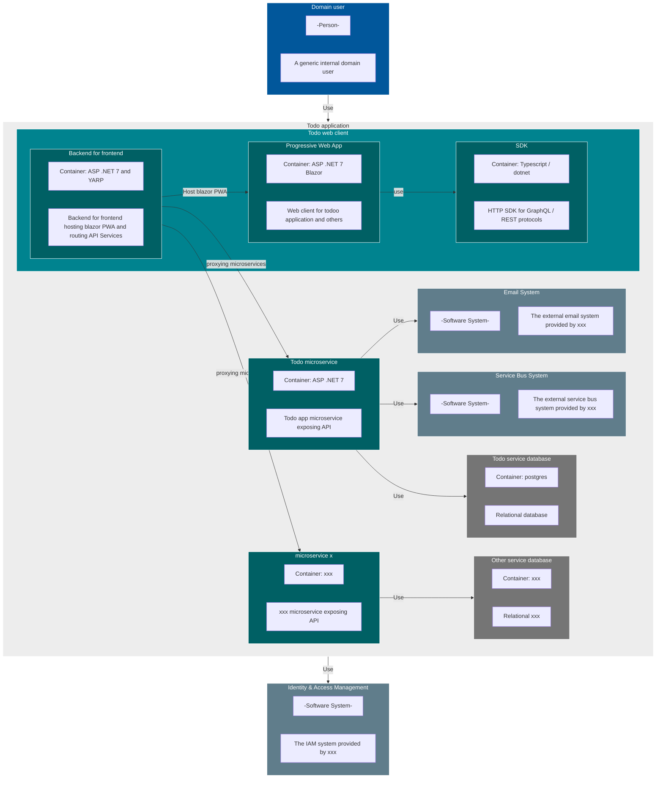

# Solution architecture schema

> Add your own architecture schema

--------------------------------

```mermaid
flowchart TB

subgraph DomainUser[Domain user]
        direction LR
        h1[-Person-]:::type
        d1[A generic internal domain user]:::description
end
DomainUser:::person

subgraph TodoApp[Todo application]
    subgraph Client[Todo web client]
        subgraph pwa[Progressive Web App]
            direction LR
            h2[Container: ASP .NET 7 Blazor]:::type
            d2[Web client for todoo application and others]:::description
        end
        pwa:::internalContainer
        
        subgraph sdk[SDK]
            direction LR
            h12[Container: Typescript / dotnet]:::type
            d12[HTTP SDK for GraphQL / REST protocols]:::description
        end
        sdk:::internalContainer
        
        subgraph bff[Backend for frontend]
            direction LR
            h3[Container: ASP .NET 7 and YARP]:::type
            d3[Backend for frontend hosting blazor PWA and routing API Services]:::description
        end
        bff:::internalContainer
    end
    Client:::groupInternalContainer
    
    subgraph TodoAPI[Todo microservice]
        direction LR
        h4[Container: ASP .NET 7]:::type
        d4[Todo app microservice exposing API]:::description
    end
    TodoAPI:::internalContainer
    
    subgraph TodoData[Todo service database]
        direction LR
        h5[Container: postgres]:::type
        d5[Relational database]:::description
    end
    TodoData:::database
    
    subgraph OtherAPI[microservice x]
        direction LR
        h6[Container: xxx]:::type
        d6[xxx microservice exposing API]:::description
    end
    OtherAPI:::internalContainer
    
    subgraph OtherData[Other service database]
        direction LR
        h7[Container: xxx]:::type
        d7[Relational xxx]:::description
    end
    OtherData:::database
    
    subgraph emailSystem[Email System]
        h99[-Software System-]:::type
        d99[The external email system provided by xxx]:::description
    end
    emailSystem:::externalSystem
    
    subgraph serviceBusSystem[Service Bus System]
        h10[-Software System-]:::type
        d10[The external service bus system provided by xxx]:::description
    end
    serviceBusSystem:::externalSystem
    
end
TodoApp:::internalComponent

subgraph identityAccessManagement[Identity & Access Management]
    h11[-Software System-]:::type
    d11[The IAM system provided by xxx]:::description
end
identityAccessManagement:::externalSystem

DomainUser--Use-->TodoApp
TodoAPI--Use-->emailSystem
TodoAPI--Use-->serviceBusSystem
pwa--use-->sdk
bff--Host blazor PWA-->pwa
bff--proxying microservices-->TodoAPI
bff--proxying microservices-->OtherAPI
TodoAPI--Use-->TodoData
OtherAPI--Use-->OtherData
TodoApp--Use-->identityAccessManagement

classDef application fill:#26A69A
classDef person fill:#01579B, color:#ffffff, stroke: #ffffff
classDef internalContainer fill:#006064, color:#ffffff, stroke: #ffffff
classDef groupInternalContainer fill:#00838F, color:#ffffff, stroke: #ffffff
classDef internalComponent fill:#ededed, stroke: #ffffff
classDef externalSystem fill:#607D8B, color:#ffffff, stroke: #ffffff
classDef database fill:#757575, color:#ffffff, stroke: #ffffff
```
