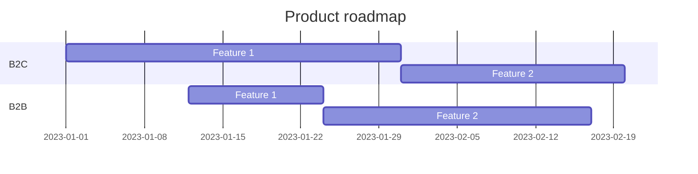

# Product Roadmap

Microscope boilerplate - Opiniated solution boilerplate & guidelines for product engineering teams

## V1

Initial setup of the boilerplate

## Template

- [x] Setup dotnet template
- [ ] Make docs a choice

## Clients
- [x] Setup mudblazor UI
- [x] Setup Preferences & Settings
    - [x] Dark / Light mode
    - [x] Drawer open
    - [x] Language support
- [x] Setup PWA
- [x] Setup Authentication
- [x] Setup Feature management
- [ ] Setup Globalization
- [ ] BFF
    - [ ] blazor hosted & SSR
    - [x] reverse proxy APIs (YARP)

## Services
### TodoList 
- [ ] Core
    - [x] Domain 
      - [x] Setup aggregate root
      - [x] Setup entities
      - [x] Setup domain events
      - [x] Setup repository interface
      - [x] Setup exceptions
    - [ ] Application
        - [x] Common behaviours
        - [x] Mappings
        - [ ] App settings check
        - [ ] Feature
            - [x] Todolist features
                - [x] Commands
                  - [x] Create todo list
                  - [x] Delete todo list
                  - [x] Update todo list
                  - [x] Create todo item
                  - [x] Delete todo item
                  - [x] Toggle todo item
                - [x] Queries
                  - [x] Get all todo lists by user
                  - [x] Get todo list by id
                - [x] Policies
                  - [x] Todolist created by policy requirement
                - [x] Events
                  - [x] SendMailOnTodoListCompleted
                  - [x] OnTodoListCompletedIntegrationEvent
            - [ ] Upload sample
  - [ ] Infrastructure
    - [ ] Persistence
         - [x] Entity framework
           - [x] EF Entities configuration
           - [x] EF Migration
         - [ ] MartenDB
    - [ ] External systems implementation
        - [x] Storage
        - [x] User
        - [ ] AI Prompting
        - [x] Mail
        - [ ] PDF
    - [ ] Bus
        - [x] MassTransit
          - [ ] OpenTelemetry
- [ ] Interface
    - [x] Setup GraphQL API
    - [x] Setup REST API
    - [x] Authentication
        - [x] OPENID JWT
        - [x] MASTER KEY
    - [x] Authorization
    - [x] HealthCheck
    - [x] Feature management
    - [ ] SignalR websocket use case
    - [ ] OpenTelemetry
- [ ] Tests
    - [x] Unit tests
        - [x] Setup Unit tests
            - [x] Todolist tests
    - [ ] Integration tests
    - [x] Architecture tests

### Storage (optional) ?
- [x] Azure blob storage
- [x] Minio
- [x] AWS S3
- [x] File system

###  Workflow (optional)
- [ ] Elsa core

###  Scheduled Jobs (optional)
- [ ] Hangfire

## Cross cutting 
- [x] SharedKernel
    - [x] use mediatr contract only

## Building blocks
- [ ] IAC
    - [ ] docker-compose
        - [x] postgres
        - [x] keycloak
          - [ ] import realms configuration
        - [x] Service Bus RabbitMQ
        - [ ] Internal services
    - [ ] Azure biceps / ARM
    - [ ] K8S

## Docs
- [x] Setup vitepress
  - [x] Mermaid
  - [x] PDF export
  - [x] Task list
- [x] Setup revealjs slides

-------------------------
## Roadmap (sample)

