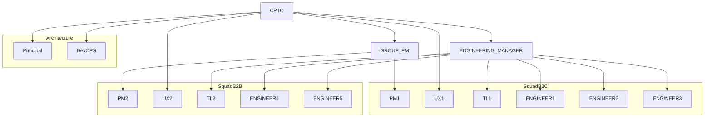

# Product Engineering Organization

## Organization diagram

## Squads

* [Squad B2C](/Organization/Squads/squad-B2C)
* [Squad B2B](/Organization/Squads/squad-B2B)
* [Architecture](/Organization/Squads/squad-architecture)
* [Management](/Organization/Squads/squad-management)