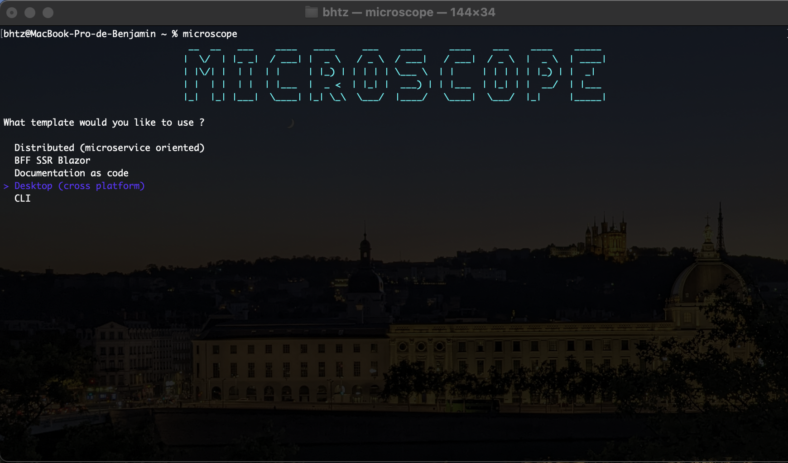

# CLI TOOL

> Microscope dotnet tool is a CLI application to generate project with console GUI



## Installation
```console
cd src/tool
dotnet build && dotnet pack
dotnet tool install --global --add-source ./nupkg Microscope.Boilerplate.Tool.CLI
```

## Export to path (MACOS)
```console
export PATH="$PATH:/Users/{username}/.dotnet/tools"
```

## Uninstall
```console
dotnet tool uninstall Microscope.Boilerplate.Tool.CLI --global
```

## Create project :
```console
microscope
```
