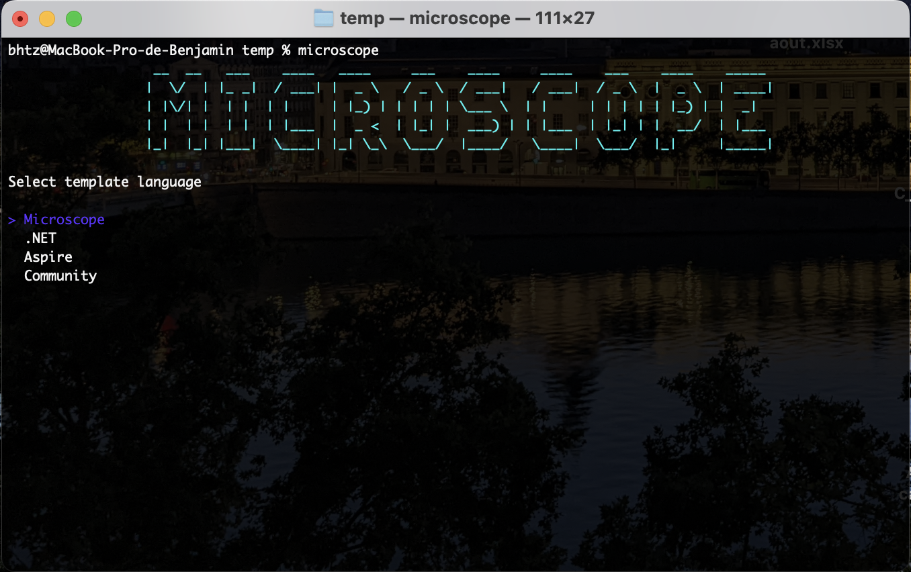

# CLI TOOL

> Microscope dotnet tool is a CLI application to generate project with console GUI

## Images

**Category selector :**


**microscope templates :**


**.NET templates :**


**Aspire templates :**


**Community templates :**


## Installation

### Install microscope CLI (as dotnet tool)
```console
cd microscope-boilerplate/tool
dotnet pack
dotnet tool install --global --add-source ./nupkg Microscope.Boilerplate.Tool.CLI
```

### Uninstall microscope CLI
```console
dotnet tool uninstall --global  Microscope.Boilerplate.Tool.CLI
```

### Install templates
> Will install Aspire, Hotchocolate templates & Aspire CLI
```console
microscope install
```
> **WARNING**: Microscope.Boilerplate.Templates are not published on nuget yet ! Make sure to install manually : [installation](/templates/installation)

### Use CLI
```console
microscope
```
