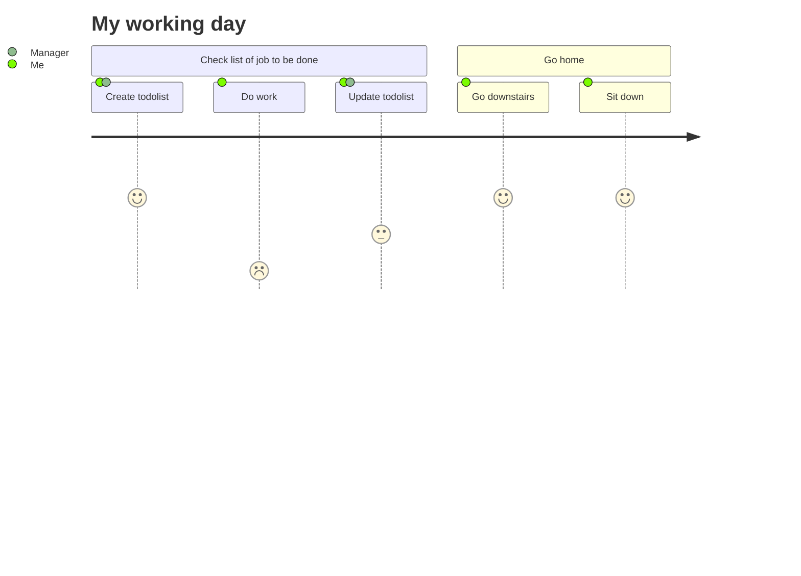

# Product strategy

## Frame

#### 🎯 Project ambition

> * What will make us say that the project will be a success?

**✔ The todo-app module will be considered a success if:** 
75% of internal users use this system every day for their task management.

#### 💥 Damage Control

> * Level to be reached

its only a sample so ... chill ;)

#### ⏰ Time Box

> * How long can we spend on the discovery ?

1 hour

## Observe

#### 🥸 First use case

**As a** {DOMAIN_USER},
**when** organizing my workdays,
**what matters most is** being efficient and thorough.
**However, it turns out that** the local tools on my computer are not user-friendly and accessible from any device, 
**so I have** to rely on my computer to access my schedule.

## Claim

> A product launch tweet of max 280 characters

## Unfold

> 5 touch points / customer journey

## Steal

> Gold nuggets

Add 3 more

- [Link to golden nuggets image]()

## Execute

> prototyping

- [Link to prototype (figma, sketch, xd, ...)]()

## Decide

> Go / NoGo decision
