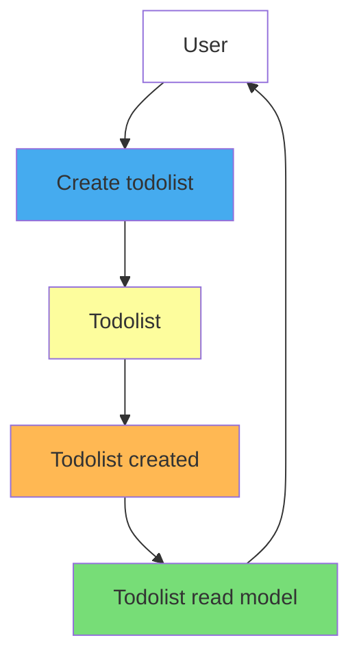
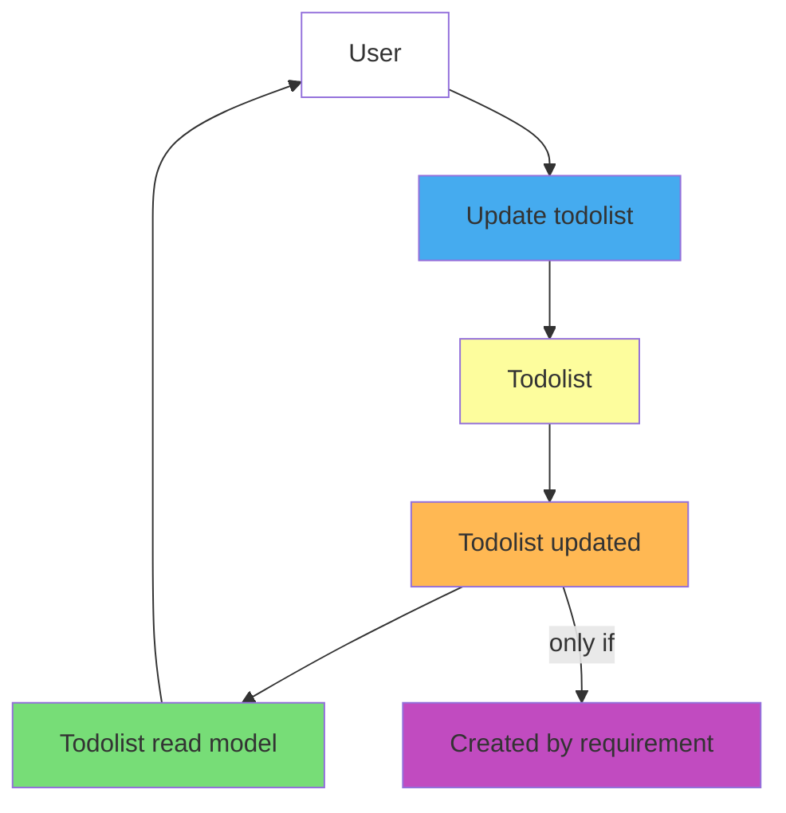
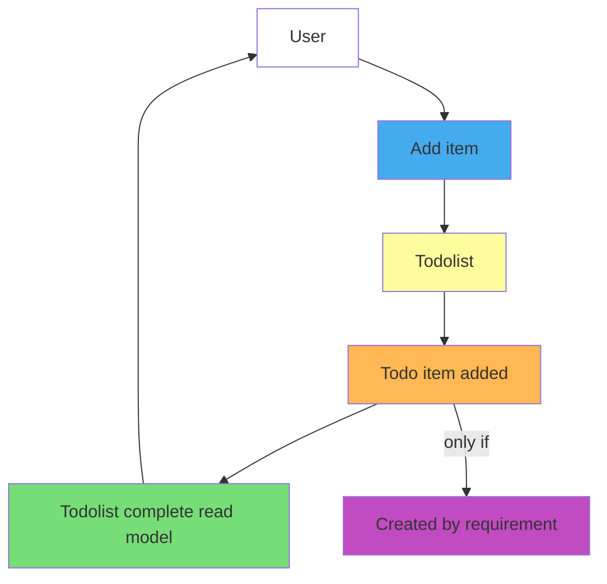
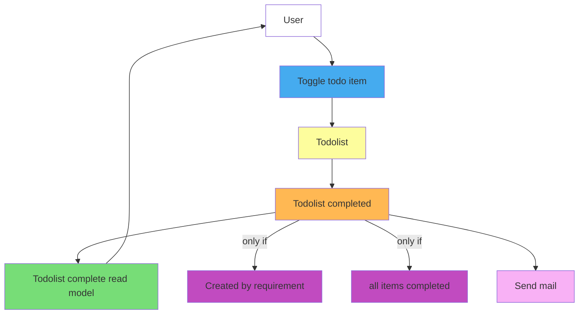

# TodoApp Event storming

## Todo list created

```mermaid
graph TD;

classDef aggregate fill:#fdfd9d
classDef command fill:#45abef
classDef readModel fill:#77dd77
classDef event fill:#ffb853
classDef policy fill:#c14bc0
classDef external fill:#f8b1f5
classDef actor fill:transparent

Actor[User]:::actor --> Command:::command
Command[Create todolist]:::command --> Aggregate:::aggregate
Aggregate[Todolist]:::aggregate --> Event:::event
Event[Todolist created]:::event --> ReadModel:::readModel
ReadModel[Todolist read model]:::readModel --> Actor:::actor
```

## Todo list updated

```mermaid
graph TD;

classDef aggregate fill:#fdfd9d
classDef command fill:#45abef
classDef readModel fill:#77dd77
classDef event fill:#ffb853
classDef policy fill:#c14bc0
classDef external fill:#f8b1f5
classDef actor fill:transparent

Actor[User]:::actor --> Command:::command
Command[Update todolist]:::command --> Aggregate:::aggregate
Aggregate[Todolist]:::aggregate --> Event:::event
Event[Todolist updated]:::event --> ReadModel:::readModel
Event:::event -- only if --> Policy[Created by requirement]:::policy 
ReadModel[Todolist read model]:::readModel --> Actor:::actor
```

## Todo item added

```mermaid
graph TD;

classDef aggregate fill:#fdfd9d
classDef command fill:#45abef
classDef readModel fill:#77dd77
classDef event fill:#ffb853
classDef policy fill:#c14bc0
classDef external fill:#f8b1f5
classDef actor fill:transparent

Actor[User]:::actor --> Command:::command
Command[Add item]:::command --> Aggregate:::aggregate
Aggregate[Todolist]:::aggregate --> Event:::event
Event[Todo item added]:::event --> ReadModel:::readModel
Event:::event -- only if --> Policy[Created by requirement]:::policy 
ReadModel[Todolist complete read model]:::readModel --> Actor:::actor
```

## Todo item removed

```mermaid
graph TD;

classDef aggregate fill:#fdfd9d
classDef command fill:#45abef
classDef readModel fill:#77dd77
classDef event fill:#ffb853
classDef policy fill:#c14bc0
classDef external fill:#f8b1f5
classDef actor fill:transparent

Actor[User]:::actor --> Command:::command
Command[Remove todo item]:::command --> Aggregate:::aggregate
Aggregate[Todolist]:::aggregate --> Event:::event
Event[Todolist completed]:::event --> ReadModel:::readModel
Event:::event -- only if --> Policy[Created by requirement]:::policy
Event:::event -- only if --> Policy2[all items completed]:::policy 
Event:::event --> External[Send mail]:::external  
ReadModel[Todolist complete read model]:::readModel --> Actor:::actor
```

## Toggle todo item

```mermaid
graph TD;

classDef aggregate fill:#fdfd9d
classDef command fill:#45abef
classDef readModel fill:#77dd77
classDef event fill:#ffb853
classDef policy fill:#c14bc0
classDef external fill:#f8b1f5
classDef actor fill:transparent

Actor[User]:::actor --> Command:::command
Command[Toggle todo item]:::command --> Aggregate:::aggregate
Aggregate[Todolist]:::aggregate --> Event:::event
Event[Todolist completed]:::event --> ReadModel:::readModel
Event:::event -- only if --> Policy[Created by requirement]:::policy
Event:::event -- only if --> Policy2[all items completed]:::policy 
Event:::event --> External[Send mail]:::external  
ReadModel[Todolist complete read model]:::readModel --> Actor:::actor
```

## Additional resources

