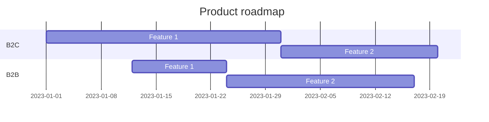

# Microscope.Boilerplate roadmap

> Add your own awesome project roadmap

## Release 1

- [x] Setup dotnet template
  - [x] Setup nuget package
- [x] Multi template
  - [x] "mcsp_cli" template
  - [x] "mcsp_doc" template
    - [x] Guidelines option

## Release 2

- [x] Setup dotnet template
    - [x] Setup nuget package
- [x] Multi template
    - [x] "mcsp_cli" template
    - [x] "mcsp_doc" template
        - [x] Guidelines option

----------------------------

## Roadmap

