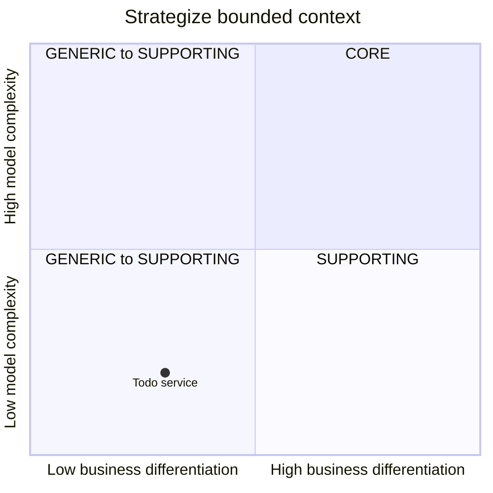

# Bounded Context Canvas

## ⚡︎ Name

**TodoApp**

## 🎯 Purpose

> Give a generic action plan / todo app capabilities through api 

## 📈 Strategic classification

### Domain

- [ ] core
- [ ] supporting
- [x] generic
- [ ] other

### Business model

- [ ] revenue
- [ ] compliance
- [ ] engagement
- [x] cost reduction

### Evolution
- [ ] genesis
- [x] custom build
- [ ] product
- [ ] commodity

## 💬 Ubiquitous language

> A "todo list" is a managed list of "todo items" with a label that can be marked as "completed" by domain user, and a managed list of tags 

## 🔏 Business decisions & policies

- only creator of todolist can update (manage tags & items or delete it
- if todo list have items and all of this items are marked as completed, so the todo list item is completed too

## 📥 Inbound communication

### Queries
 
- Get todo lists by user
- Get todo list by id

### Commands
 
- Create todo list
- Update todo list
- Remove todo list
- Add todo item
- Remove todo item
- Toggle todo item

### Events

- On todolist completed

## 📤 Outbound communication

### Queries

### Commands

### Events

- Publish "OnTodolistCompleted" event on bus

## ⁉️ Assumptions

> Can envolve in to adding users (owners) management

## 📊 Verification metrics

- lorem

## ? Open questions

- lorem

## Additional resources

---------------

---------------
